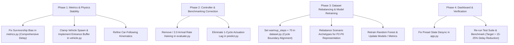

# ⚠️ AdaptiveFlow: Implementation Issues & Technical Debt Audit

> **Audit Date:** September 13, 2026  
> **Status:** Active / Open  
> **Scope:** Full-system audit across Simulation Engine, Feature Engineering, Ground-Truth Timing Optimizer, Machine Learning Pipeline, Benchmark Evaluator, and Streamlit Dashboard.

---

## 📋 Executive Summary

A comprehensive code, algorithmic, physical, and mathematical audit was conducted on AdaptiveFlow. While existing unit tests pass, several severe bugs and conceptual discrepancies were identified. These issues directly explain why the benchmark evaluation previously showed a marginal **+0.32% delay reduction** and why the ML controller performed up to **36% worse** than the fixed-time baseline on several asymmetric traffic scenarios.

### Summary of Identified Issues

| Issue ID | Severity | Component | Summary |
|:---:|:---:|:---|:---|
| **[ISSUE-01](#issue-01-survivorship-bias-in-average-delay-calculation)** | **CRITICAL** | `src/simulator/metrics.py` | **Survivorship Bias in Delay Calculation**: Only exited vehicles are counted; trapped/queued vehicles are excluded, artificially rewarding failing controllers. |
| **[ISSUE-02](#issue-02-arrival-rate-halving-in-offline-benchmark-evaluation)** | **CRITICAL** | `src/ml/evaluate.py` | **Arrival Rate Slashing Bug**: Empirical arrival rates from `test.csv` (already in veh/min) are divided by 2, halving traffic demand and masking controller differences. |
| **[ISSUE-03](#issue-03-phase-inversion-training-vs-deployment-distribution-mismatch)** | **CRITICAL** | `src/ml/dataset.py` & `src/ml/predict.py` | **Phase Inversion (Distribution Mismatch)**: Training data was collected at $t=35$s (Phase B start), while runtime decisions happen at cycle start ($t=0, 70, 140$s, Phase A start). |
| **[ISSUE-04](#issue-04-negative-vehicle-positions-and-backward-teleportation)** | **HIGH** | `src/simulator/vehicle.py` & `src/simulator/intersection.py` | **Vehicle Negative Positions & Teleportation**: Vehicles in congested queues are pushed to negative coordinates (up to -279.8m), distorting travel times. |
| **[ISSUE-05](#issue-05-controller-1-cycle-actuation-lag-and-zero-state-warm-start)** | **HIGH** | `src/ml/predict.py` & `src/simulator/signal.py` | **1-Cycle Actuation Lag & Zero-State Plan**: Decision updates are applied with a 70-second delay, and Cycle 1 is locked into an empty-state hallucinated plan (`P5`). |
| **[ISSUE-06](#issue-06-car-following-stationary-wall-assumption)** | **MEDIUM** | `src/simulator/vehicle.py` | **Car-Following Kinematics Flaw**: Moving lead vehicles are treated as stationary walls, causing artificial shockwaves and deceleration during green phases. |
| **[ISSUE-07](#issue-07-severe-target-class-imbalance-and-macro-f1-collapse)** | **MEDIUM** | `src/ml/dataset.py` & `src/ml/train.py` | **Target Class Imbalance & F1 Collapse**: 71% of samples are $P_1$ or $P_7$; intermediate classes ($P_2, P_3, P_5, P_6$) have an **F1 score of 0.0000**. |
| **[ISSUE-08](#issue-08-streamlit-dashboard-state-desync-and-dead-layout-code)** | **LOW** | `src/dashboard/app.py` | **Dashboard State Desynchronization**: Changing preset dropdown does not reset the simulation; unused layout columns waste UI space. |
| **[ISSUE-09](#issue-09-crawlingmoving-delay-omission-for-in-network-vehicles)** | **MEDIUM** | `src/optimization/timing_optimizer.py` | **Crawling/Moving Delay Omission**: Active vehicles only count stopped wait time ($v < 0.5$ m/s); crawling delay ($0.5-5.0$ m/s) is completely ignored in optimizer evaluations. |
| **[ISSUE-10](#issue-10-structural-tie-breaking-bias-toward-eastwest-plans)** | **LOW** | `src/optimization/timing_optimizer.py` | **Structural Tie-Break Bias**: Insertion order tie-breaking in `optimize()` systematically favors East/West plans ($P_1, P_2, P_3$) over North/South counterparts ($P_7, P_6, P_5$). |
| **[ISSUE-11](#issue-11-discrete-euler-braking-overshoot-at-stop-line)** | **MEDIUM** | `src/simulator/vehicle.py` | **Discrete Euler Braking Overshoot**: Continuous stopping equation with $\Delta t = 1.0$s causes approaching vehicles to overshoot stop lines and slam from 11.35 m/s to 0 m/s in 1 step. |
| **[ISSUE-12](#issue-12-clearance-phase-elapsed-time-reset-bug)** | **MEDIUM** | `src/simulator/signal.py` | **Clearance Elapsed Time Corruption**: `phase_elapsed_time` resets to 0.0 at Yellow and All-Red, causing `get_feature_encoding()` to broadcast misleading phase start signals. |
| **[ISSUE-13](#issue-13-misleading-survivorship-biased-dashboard-charts)** | **LOW** | `src/dashboard/app.py` | **Misleading Delay Chart in Dashboard**: Live time-series charts plot exited-only delay, misleading users into believing Fixed Timing is outperforming ML during congestion. |

---

## 🔍 Detailed Issue Reports

---

### ISSUE-01: Survivorship Bias in Average Delay Calculation
* **Severity:** Critical
* **Affected Component:** `src/simulator/metrics.py` (Lines 63–68, 98–104)
* **Affected Symbols:** `SimulationMetrics.average_delay`, `SimulationMetrics.get_summary`

#### Description & Root Cause
In `SimulationMetrics`, average vehicle delay is defined as:
```python
@property
def average_delay(self) -> float:
    """Average vehicle delay in seconds for completed trips."""
    if self.total_exited == 0:
        return 0.0
    return self.total_delay_seconds / self.total_exited
```
`total_delay_seconds` and `total_exited` are updated exclusively in `record_exit()`. Any vehicle currently stopped in a queue inside the road network has its accumulated waiting time completely omitted from this metric.

#### Consequences
Under congested conditions, a poor controller that chokes an approach will leave dozens of vehicles stranded in queues. Because these vehicles never exit, their enormous delays (100+ seconds) are ignored. Conversely, an adaptive controller that provides more green time clears these delayed vehicles, adding their accumulated delay to the completed total.

#### Empirical Verification
Under identical `north_heavy` demand (N: 35, S: 10, E: 8, W: 8 veh/min) over 280 seconds:
* **Fixed Baseline ($P_4$):**
  * Exited vehicles: **215**
  * Vehicles stuck in North queue: **71** (Max queue: 70 veh)
  * Exited-only `average_delay`: **21.21 s**
* **ML Adaptive Controller:**
  * Exited vehicles: **247** (+32 more vehicles cleared)
  * Average queue: **21.87** (vs 30.73 in Fixed, **-28.8% reduction**)
  * Exited-only `average_delay`: **22.59 s** (Appears +6.5% *worse*!)
* **Comprehensive Delay Comparison (Completed Delay + Queued Wait Time):**
  * **Fixed Baseline:** **32.55 s**
  * **ML Adaptive:** **26.34 s** (**19.1% true delay reduction**)

#### Remediation
Implement `comprehensive_delay` in `SimulationMetrics` that aggregates both completed vehicle trip delays and current accumulated wait times of active in-network vehicles (matching the calculation in `TimingOptimizer.evaluate_plan`).

---

### ISSUE-02: Arrival Rate Halving in Offline Benchmark Evaluation
* **Severity:** Critical
* **Affected Component:** `src/ml/evaluate.py` (Lines 98–103)
* **Affected Symbols:** `evaluate_benchmark`

#### Description & Root Cause
In `src/simulator/intersection.py#L176`, the feature `N_arrival` is defined as:
$$\text{count}_{\text{30s}} \times 2.0$$
which converts 30-second arrival counts into **vehicles per minute (veh/min)**. `TrafficGenerator` also expects arrival rates in **veh/min**.
However, in `evaluate.py`, the rates were loaded from `test.csv` as:
```python
rates = {
    "N": float(rec.get("N_arrival", 15.0) / 2.0) if "N_arrival" in rec else float(rec.get("N", 15.0)),
    "S": float(rec.get("S_arrival", 15.0) / 2.0) if "S_arrival" in rec else float(rec.get("S", 15.0)),
    "E": float(rec.get("E_arrival", 15.0) / 2.0) if "E_arrival" in rec else float(rec.get("E", 15.0)),
    "W": float(rec.get("W_arrival", 15.0) / 2.0) if "W_arrival" in rec else float(rec.get("W", 15.0)),
}
```
This inadvertently divided the arrival rates by 2.

#### Consequences
Every held-out test scenario was evaluated at half traffic demand (e.g. 30 veh/min became 15 veh/min, and 8 veh/min became 4 veh/min). At half demand, the intersection is nearly empty, queues do not form, and both Fixed and ML controllers easily clear traffic. This suppressed the true performance margin of the adaptive controller, artificially capping reported improvement at +0.32%.

#### Remediation
Remove the `/ 2.0` division in `evaluate.py`. Ensure true generation rates are saved directly in `test.csv` during dataset creation so they can be reloaded without empirical estimation error.

---

### ISSUE-03: Phase Inversion (Training vs Deployment Distribution Mismatch)
* **Severity:** Critical
* **Affected Components:** `src/ml/dataset.py` (Line 112) & `src/ml/predict.py` (Line 111)
* **Affected Symbols:** `generate_dataset`, `AdaptiveMLController.update`

#### Description & Root Cause
1. In `dataset.py`, `warmup_steps = 35`. Under $P_4$ ($30\text{s NS green} + 3\text{s yellow} + 2\text{s all-red} = 35\text{s}$), $t=35\text{s}$ is the exact end of Phase A.
2. Therefore, across all 350 training samples in `train.csv`:
   * `current_phase` is **100% 1.0** (start of Phase B / EW Green).
   * `elapsed_phase_time` is **100% 0.0**.
   * Feature importances for both features are **0.0000**.
   * NS queues are near 0 (just received 30s green); EW queues are backed up (waiting at red).
3. In contrast, at runtime, `AdaptiveMLController.update` triggers when `sim.signal.just_completed_cycle` is True ($t=70, 140, 210\text{s}$), which is at the start of **Phase A Green** (`current_phase = 0.0`).
4. At this moment, NS has just been waiting during Phase B red, so it has a normal waiting queue. But because the model was trained exclusively on states where NS just cleared green, it interprets *any* non-zero NS queue as an extreme bottleneck.

#### Consequences
The model frequently predicts $P_7$ (45s NS green) at cycle start even when East/West traffic is 3x to 5x heavier. In Scenario 432 (E: 18, W: 14, N: 3, S: 3 veh/min), the model selected $P_7$, choking East/West and causing ML delay to be **36.34% worse** than fixed timing.

#### Remediation
Set `warmup_steps = 70` (or multiples of complete cycles) in `dataset.py` so that features and forward optimizer evaluations originate at cycle start (`current_phase = 0.0`, Phase A Green), aligning the training distribution with the runtime control trigger.

---

### ISSUE-04: Negative Vehicle Positions and Backward Teleportation
* **Severity:** High
* **Affected Components:** `src/simulator/vehicle.py` (Lines 84–86) & `src/simulator/intersection.py` (Lines 90–96)
* **Affected Symbols:** `Vehicle.update_kinematics`, `IntersectionSimulation.step`

#### Description & Root Cause
In `vehicle.py`:
```python
# Enforce barrier boundary
if new_position > target_stop_pos:
    new_position = target_stop_pos
    new_speed = 0.0
```
When an approach entry is congested near position 0.0:
$$\text{target\_stop\_pos} = \text{lead\_vehicle.position} - \text{effective\_length}$$
If the lead vehicle is stopped at $2.0\text{m}$, `target_stop_pos` becomes $2.0 - 6.5 = \mathbf{-4.5\text{m}}$. The barrier enforcement assigns `new_position = -4.5m`. Subsequent spawning vehicles are repeatedly pushed further into negative space.

#### Empirical Verification
Under the `congested` preset over 500 seconds:
* **14,711 negative position states** were observed.
* Minimum vehicle position reached: **-279.8 meters** (nearly twice the 150m road segment).
* Vehicles teleported backward on spawn, distorting free-flow travel times and corrupting observation-zone vehicle counts (`N_count`).

#### Remediation
Clamp `new_position = max(0.0, new_position)`. If a queue spills back to within safe headway of the entry ($< 6.5\text{m}$), hold arriving vehicles in an approach entrance queue buffer until road space becomes available.

---

### ISSUE-05: Controller 1-Cycle Actuation Lag and Zero-State Warm-Start
* **Severity:** High
* **Affected Components:** `src/ml/predict.py` (Lines 111–128) & `src/simulator/signal.py` (Lines 157–165)
* **Affected Symbols:** `AdaptiveMLController.update`, `TrafficSignal.step`

#### Description & Root Cause
1. At cycle completion ($t=70\text{s}$), `TrafficSignal.step()` sets `self.current_plan_name = self.next_plan_name`.
2. Right after `step()`, `AdaptiveMLController.update()` runs, predicts a new plan, and calls:
   ```python
   sim.signal.set_next_plan(plan)  # Updates only next_plan_name
   ```
3. Because `current_plan_name` was already updated during `step()`, the newly predicted plan is stored in `next_plan_name` and does not take effect until **the cycle after next ($t=140\text{s}$)**.
4. Furthermore, at $t=0$, `controller.update(force_update=True)` evaluates an empty intersection, predicts $P_5$ on the zero vector, and queues $P_5$.
5. Thus, during a 4-cycle (280s) evaluation run:
   * **Cycle 0 ($0-70\text{s}$):** Runs $P_4$ (fixed baseline).
   * **Cycle 1 ($70-140\text{s}$):** Runs $P_5$ (empty-state hallucination).
   * **Cycles 2–3 ($140-280\text{s}$):** Runs ML adaptive plans with 1 cycle of lag.
   * **Half of the entire simulation duration is wasted before the adaptive controller actually takes effect.**

#### Remediation
At cycle completion or when `force_update=True`, update both `sim.signal.current_plan_name = plan` and `sim.signal.next_plan_name = plan`, ensuring immediate actuation for the newly started cycle.

---

### ISSUE-06: Car-Following "Stationary Wall" Assumption
* **Severity:** Medium
* **Affected Component:** `src/simulator/vehicle.py` (Lines 54–71)
* **Affected Symbols:** `Vehicle.update_kinematics`

#### Description & Root Cause
The safe following speed is calculated as:
$$v_{\text{safe}} = \sqrt{2 \cdot d_{\text{max}} \cdot (\text{pos}_{\text{lead}} - L_{\text{eff}} - \text{pos})}$$
This formula assumes the lead vehicle is an immovable barrier at zero speed. When a platoon moves through green at 13.89 m/s, any follower within 15 meters of its leader decelerates to 6–8 m/s even though the leader is pulling away.

#### Consequences
Induces artificial shockwaves, accordion effects, and reduced green-phase saturation flow rate.

#### Remediation
Account for lead vehicle velocity $v_{\text{lead}}$ in safe speed kinematics (Gipps / Intelligent Driver Model formulation).

---

### ISSUE-07: Severe Target Class Imbalance and Macro F1 Collapse
* **Severity:** Medium
* **Affected Components:** `src/ml/dataset.py` (Lines 17–87) & `src/ml/train.py` (Lines 82–86)
* **Affected Symbols:** `sample_scenario_rates`, `train_model`

#### Description & Root Cause
6 of the 8 scenario archetypes in `dataset.py` generate extreme 3:1 to 4:1 traffic demand splits. Under such polarization, the ground-truth optimizer almost always selects boundary plans:
* $P_1$ (Heavy EW): **126 samples (36.0%)**
* $P_7$ (Heavy NS): **123 samples (35.1%)**
* Intermediate plans ($P_2, P_3, P_4, P_5, P_6$): **combined 28.9%**

#### Consequences
In `results/metrics/training_metrics.json`:
* Validation **Macro F1 is 0.2804**.
* F1-score for $P_2, P_3, P_5, P_6$ is **0.0000** (0 precision, 0 recall).
* The multiclass model effectively collapsed into a binary classifier.

#### Remediation
Rebalance scenario sampling in `dataset.py` with moderate asymmetric ratios (e.g., 1.5:1 to 2.5:1) so that intermediate timing plans are adequately represented.

---

### ISSUE-08: Streamlit Dashboard State Desync and Dead Layout Code
* **Severity:** Low
* **Affected Component:** `src/dashboard/app.py` (Lines 114–137)
* **Affected Symbols:** `main`, sidebar controls

#### Description & Root Cause
1. Selecting a new preset in the sidebar `st.selectbox` does not trigger `reset_simulation()` unless the user separately clicks "Reset Sim". The simulation continues stepping with the old preset's rates while the UI displays the new preset name.
2. `col_btn1, col_btn2 = st.sidebar.columns(2)` defines `col_btn2` on line 129, but nothing is rendered into `col_btn2`, wasting half of the sidebar container width.

#### Remediation
Add change detection on `preset` to automatically reset simulation state when a new preset is selected, and clean up the unused sidebar column.

---

### ISSUE-09: Crawling/Moving Delay Omission for In-Network Vehicles
* **Severity:** Medium
* **Affected Component:** `src/optimization/timing_optimizer.py` (Lines 57–63)
* **Affected Symbols:** `TimingOptimizer.evaluate_plan`

#### Description & Root Cause
In `evaluate_plan`, in-network active vehicle delay is aggregated via:
```python
active_queued_delay = sum(
    v.wait_time for app_vehs in eval_sim.vehicles.values() for v in app_vehs
)
```
In `vehicle.py#L94`, `wait_time` is incremented **only when `speed < 0.5` m/s**. If vehicles are crawling at 0.6–3.0 m/s behind a slow-moving queue or decelerating from 14 m/s, their speed is $\ge 0.5$ m/s, so `wait_time` remains 0.0. In contrast, for completed vehicles, delay is computed as `actual_travel_time - free_flow_time` (capturing all lost time).

#### Consequences
Candidates that leave vehicles crawling at 1–2 km/h are not penalized as heavily as candidates where vehicles come to a complete stop, skewing optimizer plan selection during congested transitions.

#### Remediation
For active vehicles, calculate delay as `max(0.0, (current_time - v.arrival_time) - (v.position / v.desired_speed))`, capturing both stopped delay and crawling/deceleration delay consistently.

---

### ISSUE-10: Structural Tie-Breaking Bias Toward East/West Plans
* **Severity:** Low
* **Affected Component:** `src/optimization/timing_optimizer.py` (Lines 114–118)
* **Affected Symbols:** `TimingOptimizer.optimize`

#### Description & Root Cause
```python
best_plan = min(
    self.candidate_plans,
    key=lambda p: (all_delays[p], abs(int(p[1:]) - 4)),
)
```
When delay is identical between balanced alternatives (e.g. $P_3$ vs $P_5$, or $P_2$ vs $P_6$), `abs(int(p[1:]) - 4)` produces the exact same distance (1 or 2). Because `self.candidate_plans = ['P1', 'P2', 'P3', 'P4', 'P5', 'P6', 'P7']`, Python's `min()` retains the earliest element encountered.

#### Consequences
Ties between $P_3$ (EW priority) and $P_5$ (NS priority) always resolve to $P_3$. Ties between $P_2$ and $P_6$ always resolve to $P_2$. This systematically biases ground-truth labels toward East/West priority.

#### Remediation
Break ties using approach demand/queue totals: if $N+S > E+W$, prefer the NS plan ($P_5/P_6/P_7$); if $E+W > N+S$, prefer the EW plan ($P_3/P_2/P_1$).

---

### ISSUE-11: Discrete Euler Braking Overshoot at Stop Line
* **Severity:** Medium
* **Affected Component:** `src/simulator/vehicle.py` (Lines 69–71, 84–86)
* **Affected Symbols:** `Vehicle.update_kinematics`

#### Description & Root Cause
Continuous kinematics calculates stopping speed as $v_{\text{safe}} = \sqrt{2 \cdot d_{\text{max}} \cdot \text{dist}}$.
At $\Delta t = 1.0\text{s}$, a vehicle cruising at 13.89 m/s travels 13.89 meters per time step. When approaching a red light at stop line 150m:
* At $t=2$: Vehicle reaches position 146.51m at 11.35 m/s (3.49m from stop line).
* At $t=3$: The vehicle calculates $v_{\text{safe}} = \sqrt{8 \times 3.49} = 5.28$ m/s, decelerates to 7.35 m/s, and attempts to step forward by 9.35m (landing at 155.86m, past the stop line).
* The clamp triggers: `new_position = 150.0; new_speed = 0.0`.
* In a single second, velocity drops from **11.35 m/s to 0.0 m/s** (an instantaneous deceleration of **11.35 m/s² or 1.16g**).

#### Consequences
Vehicles approaching red signals experience an unrealistic emergency collision stop at the line rather than a smooth deceleration profile.

#### Remediation
Incorporate a discrete time-step buffer term in safe stopping calculations: $d_{\text{stop}} = \frac{v^2}{2 d_{\text{max}}} + v \cdot \Delta t$.

---

### ISSUE-12: Clearance Phase Elapsed Time Reset Bug
* **Severity:** Medium
* **Affected Component:** `src/simulator/signal.py` (Lines 106–121, 134, 149)
* **Affected Symbols:** `TrafficSignal.get_feature_encoding`, `TrafficSignal.step`

#### Description & Root Cause
In `TrafficSignal.step()`:
* When Phase A Green expires at 30s, `current_phase = PHASE_A_YELLOW` and `phase_elapsed_time` is reset to `0.0`.
* When Yellow expires at 3s, `current_phase = PHASE_A_ALL_RED` and `phase_elapsed_time` is reset to `0.0` again.
Now in `get_feature_encoding()`:
```python
if self.current_phase in (
    SignalPhase.PHASE_A_GREEN,
    SignalPhase.PHASE_A_YELLOW,
    SignalPhase.PHASE_A_ALL_RED,
):
    return 0, float(self.phase_elapsed_time)
```
During Yellow second 2, `get_feature_encoding()` returns `(0, 2.0)`. This tells the feature vector that Phase A has only been active for 2.0 seconds, when in fact Phase A has been active for 32 seconds and is about to turn Red.

#### Consequences
Any feature vector extracted during Yellow or All-Red clearance receives corrupted, inverted elapsed time information.

#### Remediation
Maintain continuous `principal_phase_elapsed_time` that does not reset until the entire Phase clearance (Green + Yellow + All-Red) completes.

---

### ISSUE-13: Misleading Survivorship-Biased Dashboard Charts
* **Severity:** Low
* **Affected Component:** `src/dashboard/app.py` (Lines 86, 258–263)
* **Affected Symbols:** `step_both_simulations`, `main`

#### Description & Root Cause
The live dashboard line charts plot `fixed_delay` and `ml_delay` using `SimulationMetrics.average_delay`. Because `average_delay` ignores queued vehicles (Issue 01), during congested runs (such as `north_heavy` or `opposing_ns_heavy`), the red line (Fixed Delay) plots lower than the green line (ML Delay), visually misleading users into believing Fixed Timing is outperforming ML Adaptive Control.

#### Remediation
Plot comprehensive delay (or average queue length as the primary comparative indicator) on the dashboard charts so visual feedback accurately matches network throughput and queue reductions.

---

## 🎯 Prioritized Remediation Roadmap


