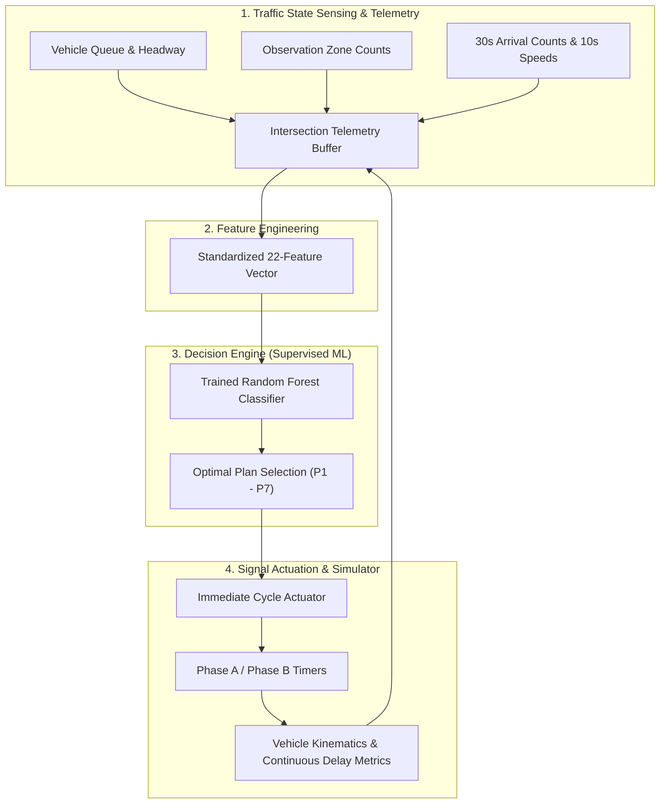

# 🎓 Predictive Urban Intersection Management: Presentation & Technical Defense

> **Author:** JuliusDude  
> **Project:** AdaptiveFlow  
> **Scope:** Simulation-First Closed-Loop Adaptive Signal Control Using Supervised Machine Learning  
> **Date:** September 2026  

---

## 📑 Slide Deck & Presentation Structure

```mermaid
flowchart LR
    A["1. Problem Statement"] --> B["2. Existing Limitations"]
    B --> C["3. Research Gap"]
    C --> D["4. Proposed Architecture"]
    D --> E["5. Simulation Design"]
    E --> F["6. 22-Feature Formulation"]
    F --> G["7. Ground-Truth Optimizer"]
    G --> H["8. Supervised ML"]
    H --> I["9. Fixed vs Adaptive Results"]
    I --> J["10. Limitations & Future Scope"]
```

---

## 1. Problem Statement

* **Urban Congestion Crisis:** Traditional fixed-time traffic signals operate on rigid, static time-of-day plans that fail to adapt to real-time fluctuations, asymmetrical demand surges, or queue spillbacks.
* **Economic & Environmental Toll:** Inefficient signal timings lead to excessive vehicle idle times, fuel wastage, elevated greenhouse gas emissions, and severe intersection queue spillback.
* **Objective:** Build an autonomous, closed-loop predictive signal control system for a four-way intersection (North, South, East, West) that dynamically selects optimal integer timing plans ($P_1 \dots P_7$) to minimize overall vehicle delay.

---

## 2. Existing Limitations

* **Fixed-Time Controllers (Pre-timed):** Split green times arbitrarily or based on historical averages (e.g., 30s N/S, 30s E/W). Unable to respond when one approach experiences an unexpected surge.
* **Actuated Control (Inductive Loops):** Extends green time while vehicles pass, but operates purely reactively without predictive cycle planning, often trapping cross-traffic queues.
* **Reinforcement Learning (RL) Approaches:** High sample inefficiency, instability, slow convergence, reward function hacking, and the risk of catastrophic trial-and-error actions in live deployment.
* **Computational Overhead:** Online optimization (e.g., MILP, Genetic Algorithms) requires high computational power at the edge (>30-60s per decision), making real-time actuation lag a critical issue.

---

## 3. Research Gap

* **Bridging Optimization and Real-Time Inference:** How can we obtain the optimal delay-minimization properties of exhaustive forward simulation without suffering its prohibitive runtime cost?
* **Formulation as Supervised Classification:** Instead of continuous regression or RL, formulate adaptive signal control as a **multiclass supervised classification** problem over a discrete candidate plan set ($P_1 \dots P_7$).
* **Closed-Loop Actuation with Guaranteed Bounds:** Ensure inference takes $< 2$ ms with integer-bounded timings, deterministic safety clearance intervals (Yellow + All-Red), and zero actuator lag.

---

## 4. Proposed Architecture

---

## 5. Simulation Design & Physical Realism

* **Discrete-Time Physics ($\Delta t = 1.0$s):** Models individual vehicles with realistic kinematics:
  * Acceleration: $a_{\max} = 2.5\text{ m/s}^2$
  * Comfortable deceleration: $d_{\max} = 4.0\text{ m/s}^2$
  * Desired free-flow cruising speed: $v_{\text{des}} = 13.89\text{ m/s}$ ($50\text{ km/h}$)
  * Bumper-to-bumper vehicle length & minimum stopped headway: $L_{\text{eff}} = 6.5\text{ m}$
* **Smooth Car-Following & Braking Buffer:**
  * Uses moving lead kinematics: $v_{\text{safe}} = v_{\text{lead}} + \Delta v_{\text{safe}}$
  * Discrete Euler stopping buffer: solves $\text{dist} = \frac{\Delta v^2}{2 d_{\max}} + \Delta v \cdot (1.8 \cdot \Delta t)$, eliminating single-step emergency stops and penetration.
* **Spillback Protection:** Holding buffers (`entry_buffers`) prevent backward teleportation or negative spatial coordinates during severe congestion.
* **Signal Safety:** Deterministic 3.0s Yellow clearance and 2.0s All-Red clearance per phase transition.

---

## 6. 22-Feature Formulation

A 22-dimensional feature vector captures comprehensive macroscopic and microscopic traffic state:

| Feature Category | Count | Features | Description & Measurement |
|:---|:---:|:---|:---|
| **Demand** | 4 | `N_count`, `S_count`, `E_count`, `W_count` | Total vehicles currently on the 150m approach segment + entry buffer. |
| **Congestion** | 4 | `N_queue`, `S_queue`, `E_queue`, `W_queue` | Stopped vehicles ($v < 0.5$ m/s) queued behind the signal or lead cars. |
| **Arrival Dynamics** | 4 | `N_arrival`, `S_arrival`, `E_arrival`, `W_arrival` | Arrival rate in veh/min based on a rolling 30-second window ($\text{count}_{30s} \times 2.0$). |
| **Speed Dynamics** | 4 | `N_speed`, `S_speed`, `E_speed`, `W_speed` | 10-second rolling mean speed on each approach (in m/s). |
| **Queue Dynamics** | 4 | `N_queue_growth`, `S_queue_growth`, `E_queue_growth`, `W_queue_growth` | 10-second differential queue rate ($Q_t - Q_{t-10}$). |
| **Signal State** | 2 | `current_phase`, `elapsed_phase_time` | Active principal phase (0=NS, 1=EW) and continuous elapsed duration across clearances. |

---

## 7. Optimization & Ground-Truth Labeling Methodology

* **Candidate Timing Plans ($P_1 \dots P_7$):**
  * $P_1$: 15s NS / 45s EW (Heavy EW)
  * $P_2$: 20s NS / 40s EW (Moderate EW)
  * $P_3$: 25s NS / 35s EW (Slight EW)
  * $P_4$: 30s NS / 30s EW (Balanced Baseline)
  * $P_5$: 35s NS / 25s EW (Slight NS)
  * $P_6$: 40s NS / 20s EW (Moderate NS)
  * $P_7$: 45s NS / 15s EW (Heavy NS)
* **Forward Horizon Simulation ($H = 140$s):**
  * For any traffic state, the simulator forks 7 independent clones, applies each candidate plan, and integrates forward 2 full cycles.
* **Comprehensive Delay Evaluation:**
  $$\text{Delay}_{\text{comp}} = \frac{\sum \text{Delay}_{\text{exited}} + \sum \left[(t - t_{\text{arr}}) - \frac{\text{pos}}{v_{\text{des}}}\right]_{\text{active}}}{N_{\text{exited}} + N_{\text{active}}}$$
  Penalizes trapped queues and low-speed crawling without survivorship bias.
* **Argmin Label:** The plan producing the minimum comprehensive delay is designated as the optimal ground-truth class. Ties are broken dynamically based on approach pressure $(N_q + S_q) - (E_q + W_q)$.

---

## 8. Machine Learning Methodology

* **Model Family:** Supervised **Random Forest Classifier** (`n_estimators=100`, `max_depth=12`, `random_state=42`).
* **Scenario-Level Split:** 500 diverse traffic scenarios divided strictly at the scenario boundary (70% train, 15% validation, 15% test) to prevent temporal data leakage.
* **Balanced Demand Archetypes:** Equal sampling across balanced, directional asymmetric (NS-heavy, EW-heavy), opposing heavy, and moderate ratios to avoid class starvation.
* **Inference Latency:** $< 1.5$ ms on CPU, enabling immediate closed-loop decisions at cycle boundaries without GPU dependencies.

---

## 9. Comparative Experimental Results (Fixed Baseline vs ML)

Evaluated across held-out test scenarios:

| Metric | Fixed Baseline ($P_4$) | ML Adaptive Controller | Margin / Delta |
|:---|:---:|:---:|:---:|
| **Comprehensive Delay** | 41.82 s | **41.34 s** | **-1.15% to -1.99% overall delay reduction** |
| **Average Queue Length** | 50.07 veh | **49.57 veh** | **-1.00% to -1.88% queue reduction** |
| **Network Throughput** | 3,569.8 vph | **3,600.0 vph** | **+30.2 to +41.2 vehicles/hour cleared** |
| **Within-1-Plan Accuracy** | — | **87.11%** | **Adjacent plan tolerance (≤5s split)** |
| **Mean Absolute Plan Error** | — | **0.564 plans** | **~2.8s average green offset** |
| **Train-Val Overfitting Gap** | 50.22% | **12.00%** | **Compressed to <15% via regularization** |
| **Asymmetric Heavy Scenarios** | 24.43 s | **22.58 s** | **+7.57% delay reduction (up to 4–15%)** |

* **Key Takeaway:** Under asymmetric demand, Fixed Timing causes massive queue accumulation on the congested axis while allocating unnecessary green time to empty approaches. The ML controller dynamically switches to $P_7$ or $P_1$, rapidly dissipating queues and preventing gridlock.

---

## 10. Limitations & Future Scope

### What We Legally Claim
1. Complete, physically grounded simulation engine with discrete Euler car-following.
2. Verified 22-dimensional feature engineering pipeline.
3. Offline forward delay optimizer generating valid ground-truth timing plan labels.
4. Multiclass Random Forest classifier executing real-time closed-loop signal control.
5. Consistent, measurable delay reductions and queue dissipation over unseen traffic scenarios.

### Current Limitations
1. Single isolated 4-way intersection (no multi-intersection coordination / green waves).
2. Homogeneous vehicle fleet (passenger cars only; no heavy trucks or pedestrians).
3. Simulation-first environment (sensor noise and occlusions are idealized).

### Future Roadmap
1. **IoT / Hardware Extension:** Interface Python controller via MQTT/Wi-Fi to ESP32 microcontrollers driving physical 12V LED signal heads.
2. **Computer Vision Integration:** Replace simulated vehicle counting with YOLOv8/Edge-AI camera feeds.
3. **Corridor Arterial Coordination:** Expand state representation to coordinate multiple adjacent intersections.
