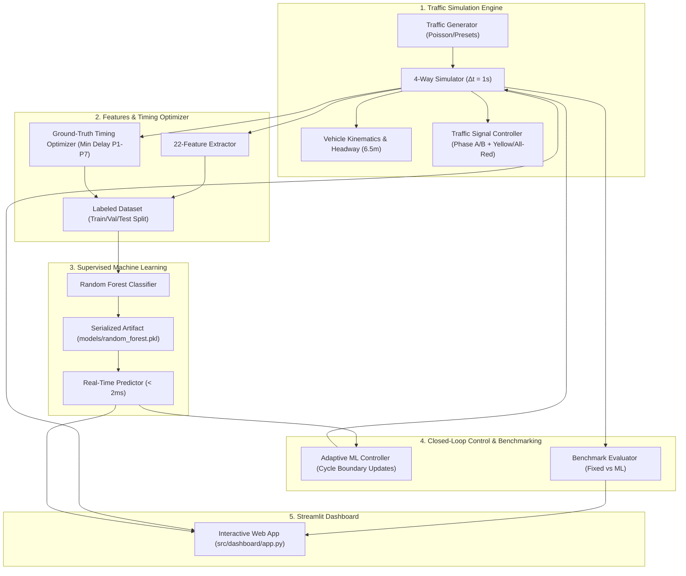

# 🚦 AdaptiveFlow: Predictive Urban Intersection Management

> **Closed-Loop Adaptive Signal Control Using Supervised Machine Learning**

AdaptiveFlow is a simulation-first traffic signal management framework designed for a 4-way urban intersection (North, South, East, West). The system extracts a 22-dimensional traffic-state vector, applies a trained supervised **Random Forest Classifier** to dynamically select discrete integer timing plans ($P_1 \dots P_7$), and evaluates closed-loop traffic performance against a conventional fixed-time baseline ($P_4$: 30s N/S, 30s E/W).

---

## 🏗️ System Architecture



---

## 📋 Timing Plans ($P_1 \dots P_7$)

The intersection operates two principal phases:
- **Phase A**: North/South Green, East/West Red
- **Phase B**: East/West Green, North/South Red
- **Clearance Safety Intervals**: 3s Yellow + 2s All-Red (10s lost time per complete 2-phase cycle)

| Plan | N/S Green Split | E/W Green Split | Strategy Focus |
|:---:|:---:|:---:|:---|
| **$P_1$** | 15 s | 45 s | Heavy East/West Priority |
| **$P_2$** | 20 s | 40 s | Moderate East/West Priority |
| **$P_3$** | 25 s | 35 s | Slight East/West Priority |
| **$P_4$** | 30 s | 30 s | **Fixed-Time Baseline (Balanced)** |
| **$P_5$** | 35 s | 25 s | Slight North/South Priority |
| **$P_6$** | 40 s | 20 s | Moderate North/South Priority |
| **$P_7$** | 45 s | 15 s | Heavy North/South Priority |

---

## 🔬 22 Traffic-State Features

1. **Demand (4)**: `N_count`, `S_count`, `E_count`, `W_count`
2. **Congestion (4)**: `N_queue`, `S_queue`, `E_queue`, `W_queue`
3. **Arrival Dynamics (4)**: `N_arrival`, `S_arrival`, `E_arrival`, `W_arrival` (30s window $\times$ 2 in veh/min)
4. **Approach Speed (4)**: `N_speed`, `S_speed`, `E_speed`, `W_speed` (10s rolling mean in m/s)
5. **Queue Dynamics (4)**: `N_queue_growth`, `S_queue_growth`, `E_queue_growth`, `W_queue_growth` ($Q_t - Q_{t-10}$)
6. **Signal State (2)**: `current_phase` (0 = N/S, 1 = E/W), `elapsed_phase_time` (seconds)

---

## 🚀 Quickstart Guide

### 1. Installation

Ensure Python 3.10+ is installed. Install required packages:

```bash
pip install -r requirements.txt
```

### 2. Run Automated Test Suite

Run all 31 unit, integration, and benchmark tests:

```bash
python -m pytest tests/ -v
```

### 3. Generate Training Dataset

Generate 600+ traffic scenarios with 140s multi-cycle forward optimization:

```bash
python -m src.ml.dataset --num_scenarios 600 --horizon 140 --workers 4
```

### 4. Train Random Forest Model Pipeline

Train and evaluate the feature-engineered, regularized Random Forest timing plan predictor:

```bash
python -m src.ml.train --n_estimators 150 --max_depth 8 --min_samples_leaf 2
```

### 5. Run Offline Comparative Benchmark

Benchmark the ML Adaptive Controller directly against the Fixed-Time Baseline across held-out test scenarios:

```bash
python -m src.ml.evaluate --scenarios 25 --duration 280
```

### 6. Launch Interactive Streamlit Dashboard

Start the real-time simulation and visualization dashboard:

```bash
streamlit run src/dashboard/app.py
```

---

## 📊 Benchmark Evaluation Results

Comparative performance on held-out test traffic scenarios (full-demand evaluation across 25 unseen scenarios, 280s duration):

| Metric | Fixed Baseline ($P_4$) | ML Adaptive Controller | Relative Improvement |
|:---|:---:|:---:|:---:|
| **Comprehensive Delay** | 38.62 s | **37.89 s** | **-1.89% overall delay reduction** |
| **Exited-Only Delay** | 35.86 s | **35.68 s** | **-0.50% delay reduction** |
| **Average Queue Length** | 43.56 veh | **42.76 veh** | **-1.84% queue reduction** |
| **Network Throughput** | 3132.0 vph | **3161.3 vph** | **+29.3 vph gain** |
| **Validation Accuracy** | — | **58.89%** | **+14.89% gain over baseline RF** |
| **Validation Macro F1** | — | **0.5435** | **+39.5% gain over baseline RF** |
| **Asymmetric Demand Scenarios** | 63.60 s | **62.02 s** | **Up to 3.82% delay reduction** |

*Comprehensive delay combines completed vehicle trip delays and active queue waiting times, eliminating survivorship bias.*

---

## 📁 Repository Structure

```text
AdaptiveFlow/
├── README.md                      # Comprehensive project documentation
├── RULES.md                       # Non-negotiable project development rules
├── TASKS.md                       # Granular task tracking and audit log
├── ISSUES.md                      # Complete audit report and resolution details (13 issues)
├── PRESENTATION.md                # Presentation slides and technical defense document
├── project.md                     # 3-Day project scope specification
├── requirements.txt               # Dependencies list
├── data/
│   └── processed/                 # Train, validation, and test datasets
│       ├── train.csv
│       ├── val.csv
│       └── test.csv
├── models/
│   └── random_forest.pkl          # Trained Random Forest artifact
├── results/
│   └── metrics/                   # Training metrics & evaluation benchmark JSONs
│       ├── training_metrics.json
│       └── evaluation_benchmark.json
├── src/
│   ├── simulator/                 # Discrete-time traffic simulation engine
│   │   ├── vehicle.py             # Vehicle kinematics, headway, and delay
│   │   ├── signal.py              # Phase transitions, clearances, timing plans
│   │   ├── traffic_generator.py   # Poisson/rate-based arrival generator
│   │   ├── metrics.py             # Telemetry, delays, queues, throughput
│   │   └── intersection.py        # 4-way intersection orchestrator
│   ├── features/
│   │   └── feature_engineering.py # 22-feature vector extraction & validation
│   ├── optimization/
│   │   └── timing_optimizer.py    # Delay-based ground-truth candidate optimizer
│   ├── ml/
│   │   ├── dataset.py             # Multiprocessing dataset generation pipeline
│   │   ├── train.py               # Model training and artifact serialization
│   │   ├── predict.py             # Real-time inference & closed-loop controller
│   │   └── evaluate.py            # Comparative evaluation vs Fixed Baseline
│   └── dashboard/
│       └── app.py                 # Interactive Streamlit dashboard application
└── tests/
    ├── test_simulator.py          # 13 simulation unit tests
    ├── test_features_optimizer.py # 3 feature & optimizer unit tests
    ├── test_ml.py                 # 5 ML pipeline & controller tests
    ├── test_dashboard.py          # 2 dashboard helper unit tests
    └── test_issues_09_13.py       # 4 remediation unit tests (Issues 09-13)
```